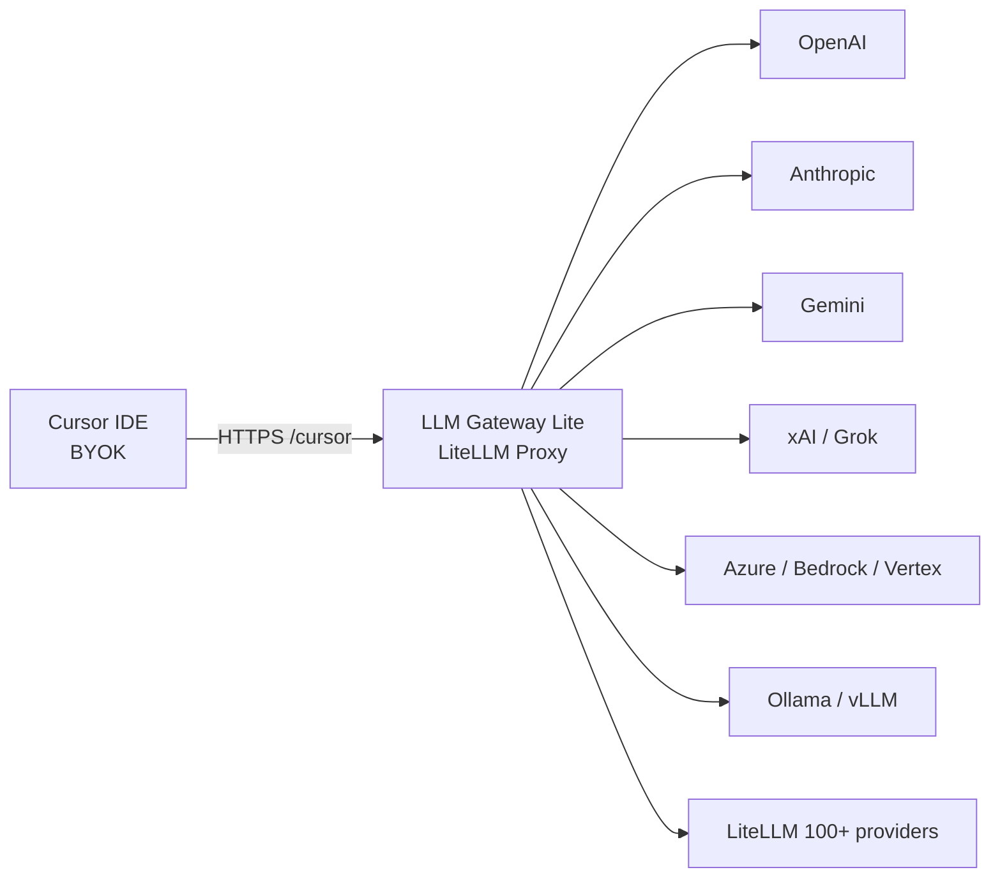

# LLM Gateway Lite

**LiteLLM 経由で、Cursor の BYOK に LiteLLM が扱えるすべてのモデルを渡す。**

Cursor の Bring Your Own Key は OpenAI 互換です。LiteLLM はすでに [100 以上のプロバイダ](https://docs.litellm.ai/docs/providers) を話します。このリポジトリはその間に立つ、自分用の Docker ゲートウェイです。Ask / Plan / Agent から OpenAI、Anthropic、Gemini、xAI/Grok、Azure、Bedrock、Ollama、OpenRouter、そして LiteLLM がルーティングできる任意のモデルを呼べます。

[English](README.md) | [简体中文](README.zh-CN.md) | **日本語**

[](https://github.com/Ninthless/llm-gateway-lite/actions/workflows/ci.yml)
[](LICENSE)
[](https://docs.litellm.ai)
[](https://docs.litellm.ai/docs/tutorials/cursor_integration)
[](https://docs.docker.com/compose/)

[](https://www.rainyun.com/Nzc5MDEw_)

## なぜあるのか

Cursor BYOK が欲しいのは、OpenAI 互換の Base URL とキー 1 本です。LiteLLM はエコシステムで最も広い OpenAI 互換トランスレータです。Cursor をこのゲートウェイに向ければ、LiteLLM が支えるモデルはすべてカスタムモデルになります。

1. LiteLLM UI に、自分のプロバイダキーで上流を追加する
2. Cursor 用の Virtual Key を発行する
3. Override OpenAI Base URL を `https://your-domain/cursor` にする
4. 公開モデル名で Ask / Plan / Agent する

キーも課金も自分の側。IDE は Cursor のまま。プロトコル変換は LiteLLM が担います。

## 構成



ローカルは 3 コンテナです。

| サービス | 役割 |
| --- | --- |
| `litellm` | 公式 LiteLLM UI、OpenAI 互換 `/v1`、Cursor `/cursor` |
| `db` | モデル、資格情報、Virtual Key、予算、利用量を持つ PostgreSQL |
| `redis` | ルーティング協調と fallback |

イメージは LiteLLM `v1.98.0-rc.1` を固定しています（Agent モードは `v1.97.0+`）。モデルは DB に入ります（`store_model_in_db: true`）。`call_id_hook.py` はルータ前に Cursor のメッセージ形状と Responses 互換フィールドを整えます。

カスタムキーで使えるモードとモデルは Cursor 側の制限に従います。Cursor には公開 HTTPS を渡してください。`localhost` はゲートウェイの起動と自己テスト用です。

## クイックスタート

`.env.example` を `.env` にコピーし、ランダムな秘密情報を入れます。`scripts/init.*` は Master Key、Salt Key、Postgres パスワード、ローカル URL を生成します。ローカル Compose には `UI_PASSWORD` と `REDIS_PASSWORD` も必要です。

Windows PowerShell:

```powershell
Copy-Item .env.example .env
notepad .env
docker compose up -d --build
```

Linux / macOS:

```sh
cp .env.example .env
# .env を編集してランダムな秘密情報を入れる
docker compose up -d --build
```

| 用途 | URL |
| --- | --- |
| 管理 UI | `http://localhost:3029/ui/` |
| 準備確認 | `http://localhost:3029/health/readiness` |
| OpenAI 互換 API | `http://localhost:3029/v1/` |
| Cursor Base URL | `http://localhost:3029/cursor` |

ログインは `UI_USERNAME`（既定 `admin`）と `UI_PASSWORD`。`LITELLM_MASTER_KEY` はプロキシ管理者 API キーです。Cursor には Virtual Key を使います。

## Cursor につなぐ

Cursor Settings → Models:

1. OpenAI API Key を有効にし、LiteLLM Virtual Key を貼る
2. Override OpenAI Base URL を有効にする
3. Base URL を `https://your-domain/cursor` にする（ローカル確認は `http://localhost:3029/cursor`）
4. LiteLLM の **Public Model Name** を追加する

```text
Base URL:  https://your-domain/cursor
API Key:   LiteLLM Virtual Key
Model:     your-public-model-name
```

`/cursor` は [LiteLLM 公式の Cursor 連携](https://docs.litellm.ai/docs/tutorials/cursor_integration) です。Cursor 内蔵モデルと同じ名前は弾かれます。LiteLLM 側で別名を公開し、Cursor ではその別名を使ってください。

## LiteLLM モデルを足す

UI の **Models + Endpoints** を開きます。

| フィールド | 意味 |
| --- | --- |
| Public Model Name | Cursor や他クライアントが呼ぶ名前 |
| LiteLLM Model Name | プロバイダ・プロトコル・上流モデル。例: `anthropic/claude-sonnet-4-6`、`openai/responses/grok-4.6` |
| API Base | 上流のルート。例: `https://api.example.com/v1` |
| API Key | 自分のプロバイダキー |
| RPM / TPM | 任意のデプロイ単位制限 |

同じ公開名に複数デプロイをぶら下げ、LiteLLM がルーティングと fallback を行います。

その後 Virtual Key を作り、公開名（または `*`）を許可して Cursor に貼ります。Master Key、Salt Key、上流キーはゲートウェイ側だけに置きます。

## Rainyun でデプロイ

このプロジェクトの本番経路は [Rainyun RCA](https://www.rainyun.com/Nzc5MDEw_)（Rain Cloud Apps）です。`rainyun-compose.yml` を取り込み、手前に HTTPS を置き、Cursor を `https://your-domain/cursor` に向けます。

[](https://www.rainyun.com/Nzc5MDEw_)

Rainyun が初めてなら [https://www.rainyun.com/Nzc5MDEw_](https://www.rainyun.com/Nzc5MDEw_) から登録し、メモリ `2 GB` 以上のプロジェクトを作ってから **[設定とトラブルシュート](docs/configuration.ja.md)** で Compose 取り込み、秘密情報、サイトプロキシ、バックアップ、アップグレードを進めてください。

Rainyun テンプレートは LiteLLM + PostgreSQL です。ローカル Compose は Redis も含みます。レプリカを増やす、またはレート制限とルーティング状態を共有するときにクラウドへ Redis を足します。

## できること

- LiteLLM の `/cursor` 経由で Cursor Ask / Plan / Agent
- 1 本の OpenAI 互換 URL の裏に、LiteLLM が知るプロバイダ
- 公式 LiteLLM 管理 UI、Virtual Key、予算、利用量
- Cursor 向けフック（tool-call id、user メッセージ形状、Responses の `created_at`）
- ローカル Docker Compose と Rainyun RCA テンプレート

## ドキュメント

Rainyun の取り込み、リソース、バックアップ、アップグレード、セキュリティ確認、長いトラブルシュート:

**[設定とトラブルシュート](docs/configuration.ja.md)** · [English](docs/configuration.md) · [简体中文](docs/configuration.zh-CN.md)

```sh
node tests/check-static.mjs
docker compose config --quiet
docker compose -f rainyun-compose.yml config --no-interpolate --quiet
docker build -t llm-gateway-lite ./litellm
```

## ライセンス

[MIT](LICENSE)
