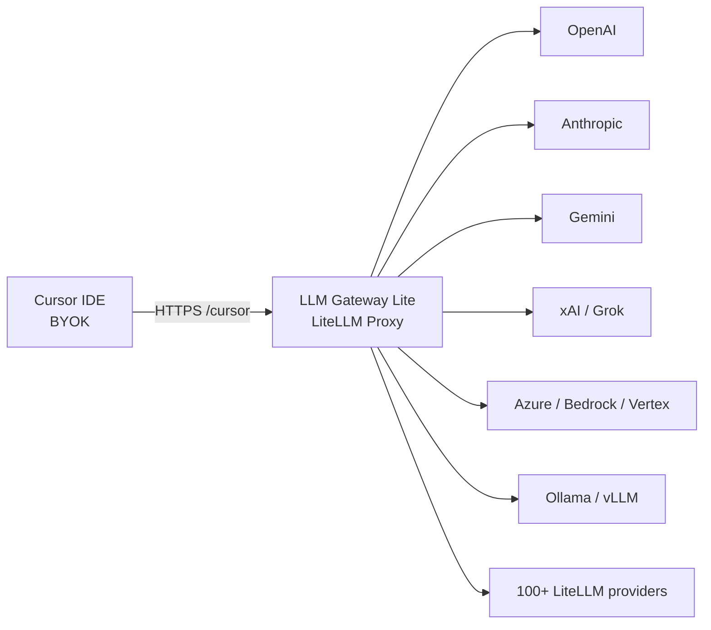

# LLM Gateway Lite

**Give Cursor BYOK every model [LiteLLM](https://docs.litellm.ai) supports.**

Cursor's Bring Your Own Key path speaks OpenAI. LiteLLM already speaks [100+ providers](https://docs.litellm.ai/docs/providers). This repo is the missing piece: a personal Docker gateway that sits between Cursor and those providers, so Ask, Plan, and Agent can use OpenAI, Anthropic, Gemini, xAI/Grok, Azure, Bedrock, Ollama, OpenRouter, and any other model LiteLLM can route.

**English** | [简体中文](README.zh-CN.md) | [日本語](README.ja.md)

[](https://github.com/Ninthless/llm-gateway-lite/actions/workflows/ci.yml)
[](LICENSE)
[](https://docs.litellm.ai)
[](https://docs.litellm.ai/docs/tutorials/cursor_integration)
[](https://docs.docker.com/compose/)

[](https://www.rainyun.com/Nzc5MDEw_)

## Why this exists

Cursor BYOK is one OpenAI-compatible Base URL plus your key. LiteLLM is the widest OpenAI-compatible translator in the ecosystem. Point Cursor at this gateway and every LiteLLM-supported model becomes a custom Cursor model:

1. Add the upstream in the LiteLLM UI with your own provider key.
2. Issue a Virtual Key for Cursor.
3. Set Cursor's Override OpenAI Base URL to `https://your-domain/cursor`.
4. Chat with that public model name in Ask, Plan, and Agent.

You keep the keys. You keep the spend. Cursor keeps the IDE. LiteLLM does the protocol work.

## How it works



The local stack is three containers:

| Service | Role |
| --- | --- |
| `litellm` | Official LiteLLM UI, OpenAI-compatible `/v1`, Cursor `/cursor` |
| `db` | PostgreSQL for models, credentials, Virtual Keys, budgets, usage |
| `redis` | Routing coordination and fallbacks |

The image pins LiteLLM `v1.98.0-rc.1` (Agent mode needs `v1.97.0+`). Models live in the database (`store_model_in_db: true`). `call_id_hook.py` normalizes Cursor message shapes and Responses-compatible payloads before they hit the router.

Cursor coverage follows what Cursor enables for custom API keys. Use a public HTTPS URL Cursor's servers can reach; `localhost` is for running and testing the gateway itself.

## Quick start

Copy `.env.example` to `.env` and fill in random secrets. `scripts/init.*` generate the Master Key, Salt Key, Postgres password, and local URL. Local Compose also needs `UI_PASSWORD` and `REDIS_PASSWORD`.

Windows PowerShell:

```powershell
Copy-Item .env.example .env
notepad .env
docker compose up -d --build
```

Linux or macOS:

```sh
cp .env.example .env
# edit .env with random secrets
docker compose up -d --build
```

| Use | URL |
| --- | --- |
| Admin UI | `http://localhost:3029/ui/` |
| Readiness | `http://localhost:3029/health/readiness` |
| OpenAI-compatible API | `http://localhost:3029/v1/` |
| Cursor Base URL | `http://localhost:3029/cursor` |

Sign in with `UI_USERNAME` (default `admin`) and `UI_PASSWORD`. `LITELLM_MASTER_KEY` is the proxy admin API key. Cursor uses a Virtual Key.

## Point Cursor at it

In Cursor Settings → Models:

1. Enable OpenAI API Key and paste a LiteLLM Virtual Key.
2. Enable Override OpenAI Base URL.
3. Set Base URL to `https://your-domain/cursor` (local smoke test: `http://localhost:3029/cursor`).
4. Add the LiteLLM **Public Model Name**.

```text
Base URL:  https://your-domain/cursor
API Key:   LiteLLM Virtual Key
Model:     your-public-model-name
```

That `/cursor` path is the [official LiteLLM Cursor integration](https://docs.litellm.ai/docs/tutorials/cursor_integration). If Cursor already ships a model under the same name, register a distinct public alias in LiteLLM and use that alias in Cursor.

## Add any LiteLLM model

Open **Models + Endpoints** in the UI:

| Field | Meaning |
| --- | --- |
| Public Model Name | Name Cursor and other clients call |
| LiteLLM Model Name | Provider, protocol, and upstream model, e.g. `anthropic/claude-sonnet-4-6` or `openai/responses/grok-4.6` |
| API Base | Upstream root, e.g. `https://api.example.com/v1` |
| API Key | Your provider key |
| RPM / TPM | Optional per-deployment limits |

The same public name can attach multiple deployments. LiteLLM routes and can fail over between them.

Then create a Virtual Key, grant it those public names (or `*`), and paste that key into Cursor. Keep Master Key, Salt Key, and upstream keys on the gateway only.

## Deploy on Rainyun

Production in this project targets [Rainyun RCA](https://www.rainyun.com/Nzc5MDEw_) (Rain Cloud Apps): import `rainyun-compose.yml`, put HTTPS in front, and point Cursor at `https://your-domain/cursor`.

[](https://www.rainyun.com/Nzc5MDEw_)

New to Rainyun? Open [https://www.rainyun.com/Nzc5MDEw_](https://www.rainyun.com/Nzc5MDEw_), create a project with at least `2 GB` RAM, then follow **[Configuration & troubleshooting](docs/configuration.md)** for Compose import, secrets, website proxy, backup, and upgrades.

The Rainyun template is LiteLLM + PostgreSQL. Local Compose also runs Redis. Add Redis in the cloud when you scale replicas or need shared rate-limit and routing state.

## What you get

- Cursor Ask, Plan, and Agent through LiteLLM's `/cursor` entry
- Every provider LiteLLM already knows, behind one OpenAI-compatible URL
- Official LiteLLM admin UI, Virtual Keys, budgets, and usage
- Cursor-oriented request hook for tool-call ids, user-message shape, and Responses `created_at`
- Local Docker Compose and a Rainyun RCA template

## Docs

Rainyun import, resource sizing, backup, upgrades, security checklist, and longer troubleshooting:

**[Configuration & troubleshooting](docs/configuration.md)** (Chinese)

```sh
node tests/check-static.mjs
docker compose config --quiet
docker compose -f rainyun-compose.yml config --no-interpolate --quiet
docker build -t llm-gateway-lite ./litellm
```

## License

[MIT](LICENSE)
