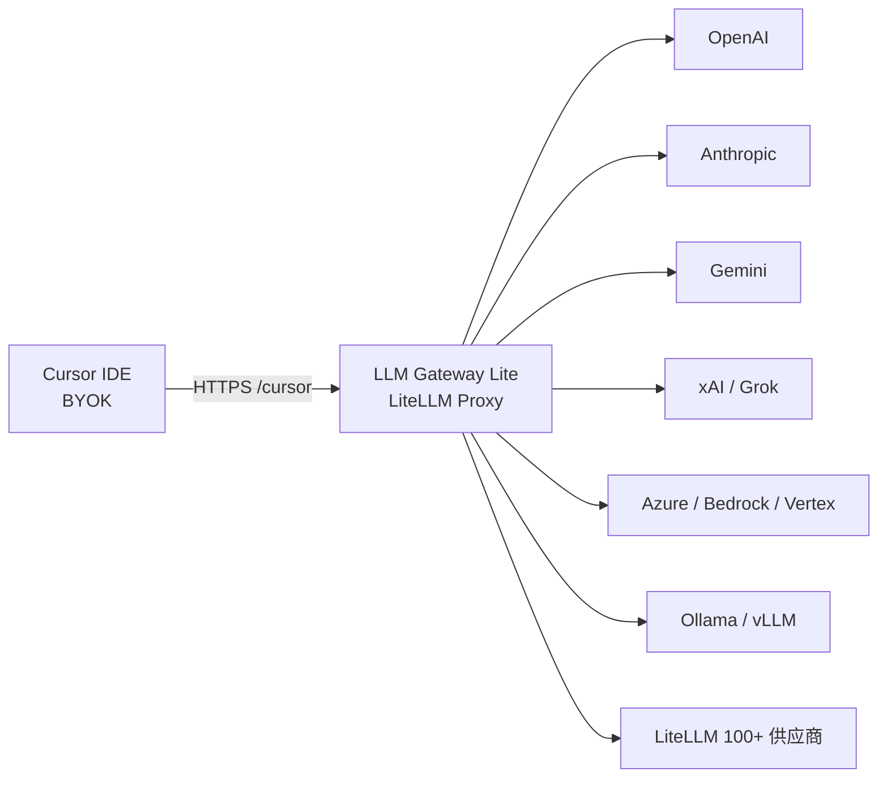

# LLM Gateway Lite

**用 LiteLLM，让 Cursor 的 BYOK 用上 LiteLLM 支持的全部模型。**

Cursor 的 Bring Your Own Key 走 OpenAI 兼容协议。LiteLLM 已经能对接 [100+ 供应商](https://docs.litellm.ai/docs/providers)。这个仓库把两者接上：一台给你自己用的 Docker 网关，夹在 Cursor 和上游之间。Ask、Plan、Agent 都可以调用 OpenAI、Anthropic、Gemini、xAI/Grok、Azure、Bedrock、Ollama、OpenRouter，以及 LiteLLM 能路由的任何模型。

[English](README.md) | **简体中文** | [日本語](README.ja.md)

[](https://github.com/Ninthless/llm-gateway-lite/actions/workflows/ci.yml)
[](LICENSE)
[](https://docs.litellm.ai)
[](https://docs.litellm.ai/docs/tutorials/cursor_integration)
[](https://docs.docker.com/compose/)

[](https://www.rainyun.com/Nzc5MDEw_)

## 这个项目做什么

Cursor BYOK 只认一个 OpenAI 兼容 Base URL 和一把 Key。LiteLLM 是目前覆盖最广的 OpenAI 兼容翻译层。把 Cursor 指到这台网关，LiteLLM 支持的模型就能变成 Cursor 里的自定义模型：

1. 在 LiteLLM 后台用你自己的上游 Key 加模型
2. 给 Cursor 发一把 Virtual Key
3. 把 Cursor 的 Override OpenAI Base URL 设成 `https://你的域名/cursor`
4. 用公开模型名在 Ask、Plan、Agent 里对话

Key 在你手里，账单在你手里，IDE 仍是 Cursor，协议转换交给 LiteLLM。

## 怎么跑起来



本地是三个容器：

| 服务 | 作用 |
| --- | --- |
| `litellm` | 官方管理后台、OpenAI 兼容 `/v1`、Cursor `/cursor` |
| `db` | PostgreSQL，保存模型、凭据、Virtual Key、预算和用量 |
| `redis` | 路由协调和 fallback |

镜像固定 LiteLLM `v1.98.0-rc.1`（Agent 模式需要 `v1.97.0+`）。模型在后台入库（`store_model_in_db: true`）。`call_id_hook.py` 在进路由器之前整理 Cursor 消息形状和 Responses 兼容字段。

Cursor 对自定义 Key 的模式和模型有自己的开关，实际覆盖以 Cursor 为准。给 Cursor 用公网 HTTPS；`localhost` 用来启动和自测网关。

## 快速开始

复制 `.env.example` 为 `.env`，填入随机密钥。`scripts/init.*` 只生成 Master Key、Salt Key、Postgres 密码和本地地址；本地 Compose 还需要 `UI_PASSWORD` 和 `REDIS_PASSWORD`。

Windows PowerShell：

```powershell
Copy-Item .env.example .env
notepad .env
docker compose up -d --build
```

Linux 或 macOS：

```sh
cp .env.example .env
# 编辑 .env，填入随机密钥
docker compose up -d --build
```

| 用途 | 地址 |
| --- | --- |
| 管理后台 | `http://localhost:3029/ui/` |
| 就绪检查 | `http://localhost:3029/health/readiness` |
| OpenAI 兼容接口 | `http://localhost:3029/v1/` |
| Cursor Base URL | `http://localhost:3029/cursor` |

后台用户名是 `UI_USERNAME`（默认 `admin`），密码是 `UI_PASSWORD`。`LITELLM_MASTER_KEY` 是代理管理员 API Key。Cursor 使用 Virtual Key。

## 接入 Cursor

Cursor Settings → Models：

1. 启用 OpenAI API Key，填 LiteLLM Virtual Key
2. 启用 Override OpenAI Base URL
3. Base URL 填 `https://你的域名/cursor`（本地自测：`http://localhost:3029/cursor`）
4. 添加 LiteLLM 的 **Public Model Name**

```text
Base URL：https://你的域名/cursor
API Key：LiteLLM Virtual Key
Model：你的公开模型名
```

`/cursor` 是 [LiteLLM 官方 Cursor 入口](https://docs.litellm.ai/docs/tutorials/cursor_integration)。若名字和 Cursor 内置模型冲突，在 LiteLLM 里换一个公开别名，Cursor 里填这个别名。

## 加上游模型

进入后台 **Models + Endpoints**：

| 字段 | 含义 |
| --- | --- |
| Public Model Name | Cursor 和其他客户端看到的名字 |
| LiteLLM Model Name | 供应商、协议和上游模型，例如 `anthropic/claude-sonnet-4-6` 或 `openai/responses/grok-4.6` |
| API Base | 上游根地址，例如 `https://api.example.com/v1` |
| API Key | 你的上游 Key |
| RPM / TPM | 可选的部署级限速 |

同一个公开名可以挂多个部署，由 LiteLLM 路由和 fallback。

然后创建 Virtual Key，放行这些公开名（或 `*`），把这把 Key 贴进 Cursor。Master Key、Salt Key 和上游 Key 只留在网关。

## 雨云部署

本项目的生产路径是 [雨云 RCA 云应用](https://www.rainyun.com/Nzc5MDEw_)：导入 `rainyun-compose.yml`，前面挂 HTTPS，再把 Cursor 指到 `https://你的域名/cursor`。

[](https://www.rainyun.com/Nzc5MDEw_)

还没有雨云账号的话，打开 [https://www.rainyun.com/Nzc5MDEw_](https://www.rainyun.com/Nzc5MDEw_) 注册，建一个至少 `2 GB` 内存的项目，然后按 **[完整配置与故障排查](docs/configuration.zh-CN.md)** 做 Compose 导入、密钥、网站代理、备份和升级。

雨云模板是 LiteLLM + PostgreSQL。本地 Compose 另有 Redis。扩副本或需要跨实例限流、路由状态时，再把 Redis 加进云端。

## 你能得到什么

- 经 LiteLLM `/cursor` 使用 Cursor Ask、Plan、Agent
- 一个 OpenAI 兼容地址，后面接上 LiteLLM 已支持的供应商
- LiteLLM 官方后台、Virtual Key、预算和用量
- 面向 Cursor 的请求整理：tool-call id、user 消息形状、Responses 的 `created_at`
- 本地 Docker Compose 和雨云 RCA 模板

## 更多文档

雨云导入、资源配额、备份升级、安全清单和更长的故障排查：

**[完整配置与故障排查](docs/configuration.zh-CN.md)** · [English](docs/configuration.md) · [日本語](docs/configuration.ja.md)

```sh
node tests/check-static.mjs
docker compose config --quiet
docker compose -f rainyun-compose.yml config --no-interpolate --quiet
docker build -t llm-gateway-lite ./litellm
```

## 许可证

[MIT](LICENSE)
